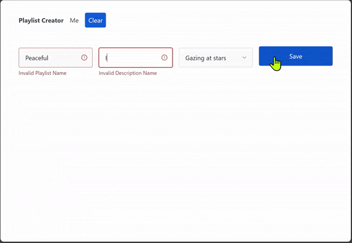
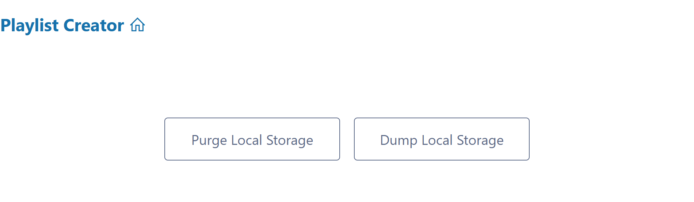
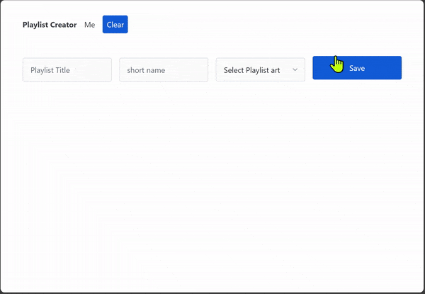
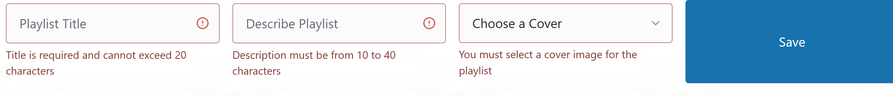
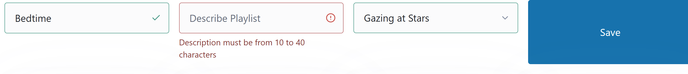

# CPSC 1520 Assignment 1: Playlist Creator

> *Web Application Development is a lot like creating beautiful music &mdash; except when it isn't.*




## Introduction

HTML/CSS/JS files are enough to create a simple static website, but a minimal setup should really involve a web server.

In this assignment, you will have to set up a node-based project that uses *Vite* as the development server. From there, you will write JavaScript code to process user input and modify a web page programmatically.

> *Websites without web servers are like websites without content - they don't really exist.*

### Manage Your Time 👀

As a take-home assignment, this is a larger project than what you would see for in-class labs. Therefore, it's critical that you plan your time carefully so that you are able to complete it by the due date. **You should be starting work on this assignment as soon as it is released.**

## Instructions

The website in this assignment allows a user to create numerous "playlists" for music. This starter kit contains the core HTML, CSS and other files to get you started. Unless otherwise noted, you should ***not*** change or delete these files.

The assignment is split into two parts:

- [**Project Setup**](#project-setup) where you will transform this repository into a **Node** project, complete with a *development server environment*, and
- [**Generating Playlists**](#javascript-code) where you will code the JavaScript to make the website interactive.

----

### Project Setup

> *In future assignments, the initial project will already be mostly pre-configured as a Node project. This assignment, however, is your opportunity to demonstrate your ability to set up a Node project from scratch.*

From the terminal, create a Node project at the **root** of this repository.

> *⚠️ **WARNING:** Be careful that the steps you take when creating the Node project do **not** cause existing files in this repo to be removed or replaced! Follow the pattern demonstrated in class (**don't** try to "Google" how to do this).*
>
> *If you do happen to replace/remove the existing files, seek help from your instructor on how to re-set and re-start this assignment.*

Next, add the following project dependencies:

| Package Name      | Dependency Type |
| ----------------- | --------------- |
| `vite`            | Developer       |
| `vitest`          | Developer       |
| `@vitest/ui`      | Developer       |
| `jsdom@26.1.0`    | Developer       |
| `semver`          | Developer       |
| `@d2t/vitest-ctrf-json-reporter` | Developer       |
| `sourdough-toast` | Normal          |

<!--
| `` | Normal |
| `` | Developer |
-->

Then modify the `package.json` file to contain the following scripts.

```json
"dev": "vite",
"test": "vitest",
"test:ui": "vitest --ui"
```

> ***Note:** You should also double-check the value for the `"name"` in `package.json` so that it is simply `"name": "skdg-a-1",`. Why? This "fix" may be needed depending on how GitHub Classroom adds the cutoff notice to the start of the `ReadMe.md`, and `pnpm init` will attempt to auto-populate the `"name"` value.*

Enter your GitHub username for the `"author": ""` field in the `package.json` project settings. Add an appropriate description to this project. Lastly, reference the supplied license by including `"license": "SEE LICENSE IN LICENSE.md"`.

In order to facilitate the automated tests, add a `vitest.config.js` file to the root of your repository.

```js
/// <reference types="vitest" />
import { defineConfig } from 'vite'

export default defineConfig({
  test: {
    globals: true,
    environment: 'jsdom',
    reporters: ['default', ['@d2t/vitest-ctrf-json-reporter', {}]]
  },
})
```

When all is said and done, you should have the `package.json`, `vitest.config.js` and a Node "lock file" at the root of your repository. (The actual type o f lock file will depend on whether you're using npm, pnpm, or yarn.)

#### Setup Verification

**Verify that your setup is functional** by running the `"dev"` and `"test"` scripts in separate terminals. You should see a page that looks like the following.

> 

- Running the `"dev"` script spins up the development server with ***HMR** (Hot Module Reload)*.
  - HMR allows you to see changes in your website as you make changes in your code.
- The `"test"` scripts run the unit tests that ensure you are meeting the requirements of this assignment.
  - When the test runs, a file should be created in your repository: `ctrf/ctrf-reporter.json`. Simply ensure the file has been created.
  - *The unit tests are mostly failing at the moment, but don't worry. At this point, you simply want to know the tests can execute properly.*
  - ⚠️ **STOP the unit tests!** Don't fall into the trap of thinking the unit tests will "tell you what to do" for this lab. They won't! Unit tests are for you to ***run after completing the assignment*** as a support to point out parts of your solution that might not be working as your instructor intends. 


> 🚀 *Be sure to **commit** your work at this stage.*

----

### JavaScript Code

> *As you progress through this portion of the assignment, remember to do **frequent** and **small** commits.*

🚨 It is **vitial** that you *carefully read this entire section **before** attempting to write any code*! Do not skip this part! Afterwards, near the end, there is a ["How to Start"](#how-to-start) guide to help you actually begin coding your solution.

#### The Goal

The `index.html` page has been constructed with two forms: one for managing the "active owner" of the music playlists and the other for creating the playlists. The animated images in the following table illustrate what interaction with those forms should look like.

|    [Playlist Owner](#playlist-owner)     |     [Playlist Creator](#playlist-creator)     |
| :--------------------------------------: | :-------------------------------------------: |
|  |  |

Your code is to be restricted to the files related to controlling user interactions with each form: `setupOwnerForm.js` and `setupPlaylistForm.js`. Visiblity of DOM elements can be controlled by using the `.hide` CSS class that has been provided for you.

#### Playlist Owner

The module for managing the "active owner" of the playlists is the `js/setupOwnerForm.js` file. **Your task** in this part of the assignment is to complete the code in this file which controls the playlist owner sign-in/log-out and their ability to save their playlists.


> *The purpose of this module is to simulate switching between different user and their playlists. Because this is just an assignment, we're not using a real-world login system or database. Instead, we're using a fake system that relies on the browser's [local storage](). All of the code that interacts with this "back-end" has already been provided for you in the `js/storage.js` module; this storage module is also the only module imported by `js/setupOwnerForm.js`.*

The `setupOwnerForm.js` module exports a single function - `setupOwnerForm()` - that is called by the `main.js` script. The `setupOwnerForm()` is responsible to set the initial visibilty of the appropriate components and to handle adding/removing a "logged on" user. Your task in this module is to implement this functionality. Here is the starting code you have been supplied with in this file.

```js
import { getOwner, setOwner, removeOwner, loadPlaylist, savePlaylist, deletePlaylist } from './storage';

/**
 * setupOwnerHandler() is a function to manage the event listener and behaviours related to working with the ownerForm.
 * That form manages switching between owners of playlists and saving/deleting playlists.
 * @param {HTMLFormElement} ownerForm - The form element for entering the owner name
 * @param {HTMLElement} inputControls - The element that contains the input controls for the form
 * @param {HTMLElement} displayContainer - The element that wraps the display of the owner name
 * @param {HTMLFormElement} playlistForm - The form element to be shown when an owner's name is available
 * @param {HTMLElement} playlistContainer - The container that holds all the playlists
 */
export const setupOwnerHandler =
  function (ownerForm, inputControls, displayContainer, playlistForm, playlistContainer) {
    // Your code here
}

// Additional private methods/variables within the module
```

> ***Note:** Pay attention to the *meaning* and *purpose* of the parameter items supplied to this exported function. This reflects information that is provided by the `main.js` call. (You can presume that the `setupOwnerHandler()` has been called with the correct inputs; there is no need to verify the parameters.)*

The `ownerForm` parameter is a `<form>` that has reference to the following controls as its form elements:

- `<input>` with the name `owner`
- `<output>` with the name `displayOwner`
- Four buttons with the same *name* - `action` - but distinct *values* (`sign-in`, `save`, `clear`, and `log-out`)

> ***Hint:** The `.submitter` property on the event identifies which button was clicked in order to submit the form.*

The remaining parameters (`inputControls`, `displayContainer`, `playlistForm`, and `playlistContainer`) are for the purpose of controlling the visibility of various parts of the web page.

##### Controlling Visibility of Components

When you first run the site, there are no "active owners" or playlists. In fact, you don't even see any login forms because all of the important parts of the page have been given a `class="hide"` in the `index.html`. All you see is the link to the home page and a footer with some buttons related to ["local storage"](#about-the-storage-module).


The first job of `setupOwnerHandler()` is to make the appropriate parts of the page visible. You control visiblity of components on the page by adding or removing the `hide` CSS class from the component.

The page is intended to show the playlist owner's name in the top bar. We don't have a real "user login" system in place, so this part is our temporary substitute. Behind the scenes, you can pretend that there is an automatic-login system available for whichever end-user (playlist owner) last visited the site. If the user closes the browser and re-opens it, they are automatically logged back in (to check, you simply have to call the storage module's `getOwner()` function). Of course, the user is also allowed to intentionally log out by simply clicking the "Log Out" button.

| Sign-In                                           | Logged-In User Controls                                |
| ------------------------------------------------- | ------------------------------------------------------ |
|  |  |


Visibility of components depends on whether there is an existing "owner" for the playlist. (Think of this as a "fake" login system.)

##### Submit Event Handler

You must set up an event handler for the `ownerForm` parameter supplied to `setupOwnerHandler()`. It is to be a single event handler for the form's `'submit'` event. Inside that handler, you will do the form processing for users to sign in and out and for users to save or delete their stored playlists. The following sections describe this behaviour.

##### Form Processing - Sign-In and Log-Out

Note that these two visual presentations - the "Sign-In" and the "Logged-In User Controls" - are all part of the same HTML `<form>` element, and there are multiple "submit" buttons for this single form (more on that later). Signing in and logging out switches the visibility of those two parts of the same `<form>`. Thus, when the user clicks "Sign In", that part of the form must be hidden and the logged-in user controls must be made visible. Additionally, you must also "un-hide" the playlist form and the playlist container.

Initially, when the page loads for the first time and `main.js` calls the `setupOwnerHandler()` function, that function must first check to see if there already is a logged-in user. This can be determined by calling the storage's `getOwner()` function. If that function returns an empty string, then no user is logged in and the "Sign-In" component must be shown. Conversely, if there is an "active" playlist owner, the other components are shown.

> *Part of the reason for using `localStorage` is to make manual testing of your assignment easier: you won't have to re-enter login information every time the page reloads from Vite's HMR as you make code changes. It also effectively mimics a "real" login system where the page "remembers" that a user is logged in. Note that there is a "Log Out" button if you want to log out and pretend to sign back in again as some other end-user. Also, there are no errors when logging in - each logged-in user is treated as though they have already been authenticated.*

Signing in works like this. The form has to process the owner's name by rendering it in the top bar and storing it in [local storage](#about-the-storage-module). The functions for local storage are in the `storage.js` module, so all you have to do to log in any given user is to call `setOwner(name)` where `name` is whatever the user typed into the `Playlist Owner` text box. You also have to set the value of the `displayOwner` control so that their name will be visible in the logged-in user controls component.

Logging out reverses the visibilty of components and clears the values stored in the `owner` and `displayOwner` controls.

<!-- in the animated image for this form that the user input and "Save" button are hidden once a name has been entered. If the input is empty, no specific error message is displayed; rather, focus should be reset to that input control so the user can try again. -->

<!-- Once an owner name has been entered, it must be saved in localStorage with `saveOwner()`. At this point, the *`inputControls`* should be hidden and the *`playlistForm`* should be shown. -->

##### Form Processing - Save and Clear Playlists

While users add to their playlist using the [playlist form](#playlist-creator), they use the buttons on the top owner form to save or delete their playlist in the "database". *(Again - there is no real database. It's faked through `storage.js`.)*

The owner form handles the button clicks from the "Save" and "Clear" buttons as a part of the form's submission. In all, there are four submit buttons on that form:

1. "Sign In" (with a `value="sign-in"` attribute)
2. "Log Out" (with a `value="log-out"` attribute)
3. "Save" (with a `value="save"` attribute)
4. "Clear" (with a `value="clear"` attribute)

You code can make the distinction between which one was clicked by checking the `.value` of the [event submitter](https://developer.mozilla.org/en-US/docs/Web/API/SubmitEvent/submitter).

When the user clicks the "Save" button, you are to take the contents of the `.innerHTML` of the playlist container can call `savePlaylist()` from the [storage module](#about-the-storage-module). Likewise, when they click the "Clear" button, you are to call `deletePlaylist()` for the user and then empty the `.innerHTML` of the playlist container.

The one distinction between these two buttons is that you must confirm with the user whenever they click "Clear", because it's a destructive action that will permanently remove their playlist information. You can use the built-in `confirm()` function for this.


----


#### Playlist Creator

When creating a playlist, the user must give it a name, description and cover image. All of these are required inputs that you must programmatically validate in your code. Error messages are to be shown if any of these items are blank (i.e.: their `.value` is an empty string).

| Empty Form                                    | Invalid Form                                          | Partially Invalid Form                                        |
| --------------------------------------------- | ----------------------------------------------------- | ------------------------------------------------------------- |
|  |  |  |


The file you will be working with in this part of the assignment is the `setupPlaylistForm.js`. This module exports a single function - `setupPlaylistHandler()` - which is called from the `main.js` script.

```js
/**
 * setupPlaylistHandler() is a function to gather and display top-level information (metadata) about a playlist.
 * @param {HTMLFormElement} playlistForm - The form used to enter playlist metadata
 * @param {HTMLElement} outputContainer - The DOM element in which playlist albums are to be displayed
 */
export const setupPlaylistHandler = function(playlistForm, outputContainer) {
    // Your code here
}

// Additional private methods/variables within the module
```

The module can assume the following characteristics of the provided `playlistForm`:

- There are two textboxes with name attributes of
  - `name` for the short name of the playlist
  - `description` for the longer description
- There is a single drop-down named `cover` to identify the image for the playlist
- There is a hidden input with the name `img-folder` that identifies the root-relative path for the folder that holds the images

When generating the HTML for the playlist, use the following markup as a sample of how the data should be presented to the user. This information is to be *prepended* to the start of the inner HTML of the *`outputcontainer`*. In other words, every time the user adds a new playlist, it should be placed before the existing playlists.

```html
<article>
    <header>
        <h2>Name</h2>
    </header>
    
    <footer>
        <p>
            Description
        </p>
        <p>
            <input name="public" type="checkbox" role="switch" /> <i>Make Public</i>
        </p>
    </footer>
</article>
```

The template includes a checkbox for whether the playlist will be public or private. Do not add any functionality to that checkbox control; it's there for "show" in this assignment.

> ***Note:** The data entered in this form is temporary on the page. Nothing is saved to the "back-end" until the user clicks the "Save" button in the navigation bar. See the [Save and Clear Playlists](#form-processing---save-and-clear-playlists) section for details.

##### Validation Process

The goal of the playlist validation is to display all input errors to the user every time they try to add a playlist. You must enforce the following rules.

- Name, description and image cover cannot be empty strings
- Name must be between 1 and 20 characters
- Description must be between 10 and 40 characters

The form's design makes use of certain `aira-*` attributes on the user inputs. For example, the `aria-invalid="true"` is used to indicate that the input is invalid. Removing that attribute or setting its value to `"false"` indicates that the input passes the validation requirements.

> ***Hint:** The `aria-describedby` attribute is not directly exposed as a property on the DOM element, so you will have to get its value using the element's `.getAttribute('aria-describedby')` method. Similarly, there are `.setAttribute(attributeName, value)` and `.removeAttribute(attributeName)` methods that you may find useful.*

Additionally, the `aria-describedby` attribute on the `<input>`/`<select>` identifies the DOM element that offers guidance to the user when they make a mistake. To make that guidance visible to the user, you'll need to remove the `.hide` class from that element. For example, consider this input control in the form:

```html
<label>
    <input name="name" type="text"
           placeholder="Playlist Title" autocomplete="off"
           aria-describedby="invalid-playlist-name" />
    <small id="invalid-playlist-name" class="hide">
        Title is required and cannot exceed 20 characters
    </small>
</label>
```

Indicating an invalid playlist name should result in markup equivalent to the following:

```html
<label>
    <input name="name" type="text"
           placeholder="Playlist Title" autocomplete="off"
           aria-invalid="true"
           aria-describedby="invalid-playlist-name" />
    <small id="invalid-playlist-name" class="">
    Invalid Playlist Name
    </small>
</label>
```

> ⚠️ ***Warning:** Do **not** attempt to modify the form's input controls via `.innerHTML`! When validating user inputs on the submit, you would have to reflect the validation feedback to the user through programmatically altering attributes on the corresponding `<input>`/`<select>` and `<small>` elements' properties.*


----

## Appendix

### How To Start

While the code for this lab is fairly straight forward, understanding how this web application is intended to run is critical. If you haven't done so, make sure you **read the entire lab description above** before you begin writing your JavaScript code. In fact, it is expected that you will have to *re-read* those descriptions a few times to get a better handle on what your code is supposed to do.

Here are some important things to consider in completing this lab.

- The two buttons - [Purge Local Storage](#purge-local-storage) and [Dump Local Storage](#dump-local-storage) - are already working. You do not need to write any code for these buttons. They exist to help you "clean up" (i.e.: *Purge*) or "view" (i.e.: *Dump*) the internal database of users and playlists whenever you think the underlying [storage module](#about-the-storage-module) might be "messed up" from your experiments with the Local Storage functions.
- Don't depend on the unit tests to guide you. Run those at or near the end of completing the lab.
- Use comments in your code to guide your thought processes. Comments can be an outline in bullet form of the tasks/functionality you want to achieve.
- Manually test the website in your browser to see if it's doing what you intend.
- Feel free, if it helps your thought processes, to split up your logic into extra functions within each script file.
- **Do NOT use global variables** in your script files to handle data. Your script files should consist of *functions* to achieve your goals.
- Read the documentation on the [Local Storage Modules/Functions](#about-the-storage-module) so that you know what each function does. This will be important in order for you to correctly call those functions.

We recommend to start your coding in the `setupOwnerForm.js` file. Here are some starting points.

1. Only one of the forms passed in requires and event listener: `ownerForm`. Add that, and log a message to the console to help you know that it's working.
1. For code that is "outside" the `ownerForm`'s event handler:
   - Remember that the visibility of components on the page depends on A) the state of the data in Local Storage, and B) the user's interactions with the forms.
   - You won't even see any forms at the beginning. So the first thing you should make visible is the `ownerForm` which provides the "Sign-in" button.
   - Later, you can check the Local Storage data to control which form is visible when the user re-opens/refreshes the web page.
1. The `ownerForm` has various controls (input, output and buttons) that are not *physically* nested within the `<form>` element. But they are *associated* with that form via the `form="faux-login"` attribute on those controls.
   - Start with handling a "sign-in" by showing/hiding the correct HTML elements (passed in to `setupOwnerHandler`)
   - Show/hide elements when the user logs out.
1. **Get the visibility working** before you try to do the other logic/processing of the form. That way you can see the correct parts of the page as you manually interact with the website.

When you get to the `setupPlaylistForm.js` file, consider these parts.

1. There is one event listener required. It is for the `playlistForm`.
1. The `playlistForm` requires various validation of user input.
   - Begin manually building/testing this with "happy-path" inputs, where you enter in values you know should be good.
   - When you are satisfied that the form correctly handles "good data", add the validation to handle "bad data".

#### Purge Local Storage

This button will remove (purge) all the data from Local Storage, giving you a "clean start" for manually testing your lab.

#### Dump Local Storage

This button will "dump" or display the contents of Local Storage in the Developer Tools Console of your browser.

<!--
## *REMOVE*

- [ ] Minimal node project setup
- [ ] DOM creation via `.innerHTML`
- [ ] Template strings and placeholders
- [ ] If/Else (Form Validation)
- [ ] Form submission
  - [ ] One with 4 buttons
  - [ ] One with one button and validation
- [ ] Event Handlers
- [ ] `new Date()` string parsing
- [ ] Show/Hide forms
- [ ] Very simple try/catch

- PPE Center - Personal Playlist Entertainment Center
- "Playlist Owner" Form
  - Owner name
- Playlist Creation *(no arrays, just DOM appending)*
  - Name of the playlist has to be from 1 to 40 characters long
  - Description has to be between 5 and 255 characters long
  - Playlist needs a cover image
  - Public/Private checkbox
  - Created Date/Time Stamp
-->


### About The Storage Module

The `storage.js` module exposes several functions for simulating access to an authentication system and database backend. Those functions have already been imported into the `setupOwnerForm.js` script file and are ready for you to use. Note that this "storage module" is a fake database implementation and is provided to simplify your completion of this assignment.

> Please refer to the notes on the [Purge Local Storage](#purge-local-storage) and [Dump Local Storage](#dump-local-storage) buttons for re-setting or viewing the "fake database" contents.

For reference, the code for the `storage.js` module is as follows.

```js
/* storage.js
 *  Manages the "preserved state" of the page between launches
 *  Think of this as a fake database system, complete with user management,
 *  but with none of the reliability or permanace of a true database system
 */

/** @type {string} */
const key = '_fauxLogin_';

/**
 * Returns the name of the current playlist owner, or an empty string if none is available.
 * (When a non-empty string is returned, it simulates an auto-login; intended for when the page loads the first time.)
 * @returns {string} The name of the playlist owner
 */
const getOwner = () => localStorage.getItem(key) || '';

/**
 * Sets the current playlist owner (simulates a sign-in).
 * @param {string} owner The name of a playlist owner to set as the current owner.
 */
const setOwner = (owner) => {
    localStorage.setItem(key, owner);
};

/**
 * Removes the current (active) playlist owner (simulates a log-out).
 * @param {string} owner The name of a playlist owner.
 *
 * > ⚠️ Warning! This is a destructive action. The owner and their playlist information will be permanently deleted.
 */
const removeOwner = (owner) => {
    localStorage.removeItem(key);
};

/**
 * Returns the contents of the owner's playlist as an HTML string. If no playlist is available, an empty string is returned.
 * @param {string} owner The name of the playlist owner.
 * @returns {string} The contents of the playlist (as an HTML string)
 */
const loadPlaylist = (owner) => localStorage.getItem(owner) || '';

/**
 * Stores the owner's playlist.
 * @param {string} owner The name of the playlist owner.
 * @param {string} data The contents of the playlist (as an HTML string)
 */
const savePlaylist = (owner, data) => {
    localStorage.setItem(owner, data);
}

/**
 * Removes the owner's playlist from storage.
 * @param {string} owner The name of the playlist owner.
 */
const deletePlaylist = (owner) => {
    localStorage.removeItem(owner);
}

export { getOwner, setOwner, removeOwner, loadPlaylist, savePlaylist, deletePlaylist }
```

### Image Credits

-  <a target="_blank" href="https://icons8.com/icon/sRwG9M4ntQFF/music">Music</a> icon by <a target="_blank" href="https://icons8.com">Icons8</a>
- Other images credited in [img/ReadMe.md](./img/ReadMe.md)

----

## Marking Guide

Your project is expected to be a functional Node project complete with automated tests. Automated tests are included, and your instructor will guide you in running the tests locally. Do **not** modify the unit tests.

> **NOTE:** A certain set of tests (marked by "PROVIDED CODE:") are provided as an internal check that the supplied code is working correctly. These tests should run "green", and you will not be given credit for these passing tests. HOWEVER, you may be docked marks if any of these tests should wind up failing and going "red". This is to ensure that you do not break the functionality of code that has been provided to you at the start of this assignment.

<!-- 
 ✓ tests/package.spec.js (11 tests) 9ms
 ✓ tests/setupOwnerForm.whenInitiallyCalled.spec.js (14 tests) 59ms
 ✓ tests/setupOwnerForm.SubmitEvent.spec.js (1 test) 32ms
 ✓ tests/setupOwnerForm.onSignIn.spec.js (11 tests) 69ms
 ✓ tests/setupOwnerForm.onSave.spec.js (2 tests) 41ms
 ↓ tests/setupOwnerForm.onClearPlaylists.spec.js (4 tests | 4 skipped)
 ↓ tests/setupOwnerForm.onLogOut.spec.js (4 tests | 4 skipped)
 ✓ tests/setupPlaylistForm.spec.js (28 tests) 192ms
 -->

- **`package.json` documentation** (11)
  - [ ] should have your GitHub username as the author
  - [ ] should have a description of the assignment
  - [ ] should have the proper reference to the license
  - [ ] should have 'vite' as a developer dependency with a min version of '6.3.5'
  - [ ] should have 'vitest' as a developer dependency with a min version of '3.1.4'
  - [ ] should have '@vitest/ui' as a developer dependency with a min version of '3.1.4'
  - [ ] should have 'jsdom' as a developer dependency with a min version of '26.1.0'
  - [ ] should have 'semver' as a developer dependency with a min version of '3.1.4'
  - [ ] should have the correct command for the 'dev' script
  - [ ] should have the correct command for the 'test' script
  - [ ] should have the correct command for the 'test:ui' script
- **`setupOwnerHandler` when initially called** (14)
  - [ ] should add a submit event listener to the owner form
  - [ ] should check the existing owner
  - [ ] should get the playlist for the existing owner
  - [ ] should populate the playlist container with the existing owner playlist
  - [ ] should make the "input-controls" element visible if there is no existing owner
  - [ ] should make the "display-name" element hidden if there is no existing owner
  - [ ] should make the "playlist-form" element hidden if there is no existing owner
  - [ ] should make the "playlists" element hidden if there is no existing owner
  - [ ] should make the "display-name" element visible for an existing owner
  - [ ] should make the "playlist-form" element visible for an existing owner
  - [ ] should make the "playlists" element visible for an existing owner
  - [ ] should make the "input-controls" element hidden for an existing owner
  - [ ] should put "Annie Bo-Dee" into the form output
  - [ ] should put "Bee Deviled" into the form output
- **`setupOwnerHandler` submit event handler** (1)
  - [ ] should prevent the default submit action
- **`setupOwnerHandler` submit event handler on Sign-In** (11)
  - [ ] should set focus to input if owner name is ""
  - [ ] should set focus to input if owner name is "  "
  - [ ] should not change visibility of current elements if owner name is ""
  - [ ] should not change visibility of current elements if owner name is "  "
  - [ ] should not call setOwner with empty name if owner name is ""
  - [ ] should not call setOwner with empty name if owner name is "  "
  - [ ] should call setOwner with the trimmed owner name
  - [ ] should call loadPlaylist with the trimmed owner name
  - [ ] should set the content of the playlist container
  - [ ] should set the value of the display owner output control
  - [ ] should set appropriate visibility for elements on the page
- **`setupOwnerHandler` submit event handler on Save playlist** (2)
  - [ ] should call savePlaylist with the owner name and playlist content 32ms
  - [ ] should not change visibility of current elements 8ms
- **`setupOwnerHandler` submit event handler on Clear playlists** (4)
  - [ ] should confirm that the user wants to clear the playlist
  - [ ] should not call delete playlist information when the action is cancelled
  - [ ] should call delete playlist information if the action is confirmed
  - [ ] should empty the playlist container if the action is confirmed
- **`setupOwnerHandler` submit event handler on Log-Out** (4)
  - [ ] should clear the contents of the playlist container
  - [ ] should clear the value of the display owner output control
  - [ ] should clear the value of the owner input control
  - [ ] should change visibility of the appropriate elements
- **`setupPlaylistForm()`** (28)
  - [ ] should add an event listener to the playlistForm
  - [ ] should prevent the default submit action
  - [ ] should show error when playlist short name is "  "
  - [ ] should show error when playlist short name is ""
  - [ ] should show error when playlist short name is "123456789012345678901"
  - [ ] should show error when playlist description is "  "
  - [ ] should show error when playlist description is ""
  - [ ] should show error when playlist description is "123456789"
  - [ ] should show error when playlist description is " 123456789 "
  - [ ] should show error when playlist description is "123456789_123456789_123456789_123456789_1"
  - [ ] should show error when playlist cover is none
  - [ ] should not add item to playlist when validation errors occur: { name: '', description: '', cover: '' }
  - [ ] should not add item to playlist when validation errors occur: { name: 'Valid', description: '', cover: '' }
  - [ ] should not add item to playlist when validation errors occur: { name: 'Good', description: 'Present and accounted for.', cover: '' }
  - [ ] should not add item to playlist when validation errors occur: { name: 'Good', description: '', cover: 'guitar.jpg' }
  - [ ] should not add item to playlist when validation errors occur: { name: '', description: 'Instrumental and Soothing', cover: '' }
  - [ ] should not add item to playlist when validation errors occur: { name: '', description: 'Digitized Vinyl Records', cover: 'vinyl.png' }
  - [ ] should give the correct input focus when validation errors occur: { name: '', description: '', cover: '', focus: 'Name' }
  - [ ] should give the correct input focus when validation errors occur: { name: 'Valid', description: '', cover: '', focus: 'Description' }
  - [ ] should give the correct input focus when validation errors occur: { name: 'Good', description: 'Present and accounted for.', cover: '', focus: 'Cover' }
  - [ ] should remove error when input corrected: { name: 'Good', description: 'Present and accounted for.', cover: '', focus: 'Cover' }
  - [ ] should remove error when input corrected: { name: 'Good', description: '', cover: 'guitar.jpg', focus: 'Description' }
  - [ ] should remove error when input corrected: { name: '', description: 'Digitized Vinyl Records', cover: 'vinyl.png', focus: 'Name' }
  - [ ] should construct a correct image path using hidden input value "/img/"
  - [ ] should construct a correct image path using hidden input value "/images/"
  - [ ] should add item to playlist
  - [ ] should add second item to playlist
  - [ ] should prepend additional items to the start of the playlist
- **Coding Standards and Other Requirements<sup>&ddagger;</sup>** (*deductions*)
  - [ ] -20% (MAX) - Failure to run as a Node projec<sup>&sect;</sup>
  - [ ] -1 - Missing your full student name in the `README.md` file.<sup>&dagger;</sup>
  - [ ] -2 - JavaScript formatting and structure
  - [ ] -1 (Each) - Breaking/altering unit tests that are checking your code.
  - [ ] -1 (Each) - Breaking/altering unit tests for *PROVIDED CODE*
  - [ ] -10 (MAX) - Notable/significant errors not captured by automated tests

> Notes:

> - <sup>&sect;</sup> - This assignment is your opportunity to assemble a Node project from a minimal set of provided HTML/CSS/JS code. If you assignment does not correctly run as a Node project, you may be given an **additional deduction** of up to 20% over the final **earned** mark.
>
>   This will be determined by the amount of effort/difficulty encountered by your instructor in attempting to correct the Node project settings. This applies only to the Node project configuration/setup. This deduction is in place because your instructor depends on your solution being able to execute automated tests.
> - <sup>&dagger;</sup> - It's assumed that your name will be at least three characters long. You should use your **full name**. Including your full name where indicated in your assignments is a regular expectation for this course, and you may be docked marks if it is not included.
> - <sup>&ddagger;</sup> - A manual review of your code will be performed to ensure it adheres to proper standards and meets any additional requirements not covered by the automated tests. Failure to meet these requirements will result in deductions indicated in the marking guide. **Note** that, due to the higher complexity of this lab, additional deductions may be made for notable or significant errors not captured by the automated tests.

### Details on Automated Test Deductions

As noted, there are automated tests to ensure you are doing regularly expected tasks (putting your name in the `README.md`) and to ensure you are **not** making changes to parts of the starter kit that we've already supplied to you. Not every lab or assignment will necessarily provide automated tests for those parts that are to remain "untouched", but you are still expected to **confine your edits/work to the areas mentioned in these specifications**.

For your reference in this assignment, the following automated tests that could result in deductions are listed below. These should already be green checks for provided code; as long as they don't go "red", you should be fine.

- **`ReadMe` documentation** (2)
  - [ ] should have the student name in the third line
  - [ ] should have the prompt for the student name in the third line
- **`PROVIDED CODE: storage.js` (using localstorage)** (12)
  - [ ] should get playlist owner
  - [ ] should get empty result from playlist owner
  - [ ] should save playlist owner
  - [ ] should remove playlist owner
  - [ ] should load owner's playlist
  - [ ] should get an empty playlist for an owner
  - [ ] should get owner using localStorage.getItem()
  - [ ] should save owner using localStorage.setItem()
  - [ ] should remove owner using localStorage.removeItem()
  - [ ] should load owner playlist using localStorage.getItem()
  - [ ] should save owner playlist using localStorage.setItem()
  - [ ] should delete owner playlist using localStorage.removeItem()
  - [ ] should never call localStorage.clear()

