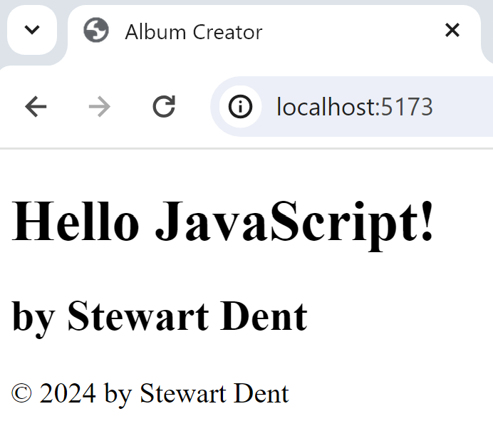

# CPSC1520 - Lab 1: Intro to JavaScript

> ***How carefully can you read instructions?** This lab outlines some expectations that might seem trivial to you or not related to the course contents per-se. Nevertheless, you should pay attention to the details of what's expected.*

## Introduction

The aim of this course is to use JavaScript as a means of programmatically controlling HTML content and user interactions.

In this lab, you are to modify `index.html` to load an external script file (`js/main.js`). The job of that script file is to programmatically modify the contents of the HTML page.

> The bulk of your work is to be done in the `js/main.js` JavaScript file. You do have to modify `index.html`, but those are *very limited changes*.

## Instructions

Your `index.html` and `main.js` files are not linked together. You must load the JavaScript file in your HTML file. To demonstrate to yourself that the JavaScript file has been correctly loaded, log the following message to the console: `"loaded"`.

Your JavaScript file must make the following modifications to the HTML content. These changes must be done by the JavaScript file; do ***not*** modify the HTML file to include these changes.

- Put the current year in the DOM element with the id of `copyright`.
- Place your full name in all the DOM elements with the `data-byline` attribute; be sure to prefix your name with the text `by `.

Your code must run correctly without any errors.

----

## Marking Guide

Your project has been set up as a Node project complete with automated tests. The project is already configured with a built-in web server; instructions on how to launch the server will be given in class. Automated tests are included, and your instructor will guide you in running the tests locally. Do **not** modify the tests or the project settings.

- **ReadMe Documentation** (2)
  - [ ] should have the student *full* name in the third line&dagger;
  - [ ] (✓) should have the prompt for the student name in the third line
- **`index.html` Content** (8)
  - [ ] should have one script tag
  - [ ] should have the script tag in the head
  - [ ] should not be an inline script
  - [ ] should not have type="module" on script tag&ddagger;
  - [ ] should have the defer attribute on script tag&ddagger;
  - [ ] should reference main.js as the source for the script
  - [ ] (✓) should not have the copyright year in the markup
  - [ ] (✓) should not have byline text in the markup (innerhtml?)
- **`main.js` Script** (7)
  - [ ] should indicate the script has been loaded in the console
  - [ ] should change the copyright text programmatically
  - [ ] should use the current year for the copyright
  - [ ] should inject byline text programmatically
  - [ ] should have the byline text start with the word "by"
  - [ ] should have a name in the byline elements
  - [ ] (✓) should not generate any console errors in the script

> Notes:
>
> - (✓) - Indicates a test that passes without really doing anything. But if you break the test, you lose the mark.
> - &dagger; - It's assumed that your name will be at least three characters long. You should use your **full name**. Including your full name where indicated in your assignments is a regular expectation for this course, and you may be docked marks if it is not included in future labs *even if we don't specifically ask you to do so*.
> - &ddagger; - In this first lab, you should not be using event listeners as a means of waiting for the document to load.

