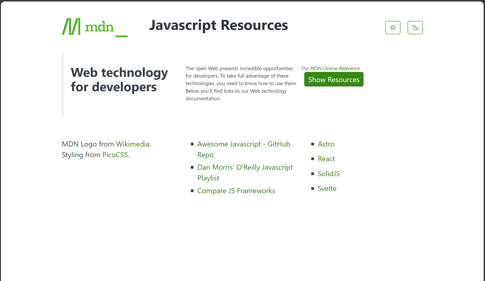
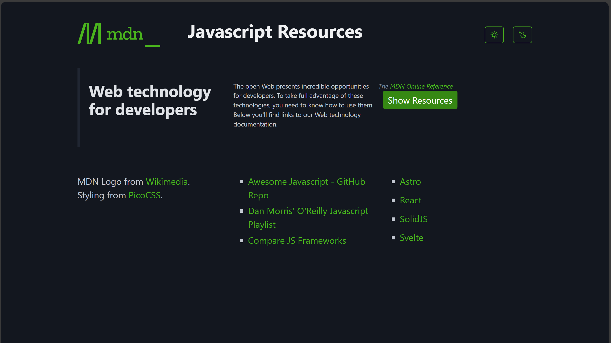
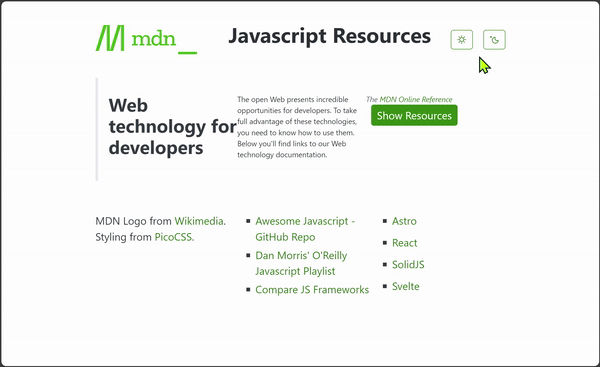

# CPSC1520 - Lab 3: Events! Functions! JS Resources!


> ***Are you able to infer technical requirements from general instructions?** You must use what you have learned so far in order to create the desired solution.*
> 
> *This lab doesn't tell you **how** to create the solution. Rather, it focuses on outlining **what** you must achieve. There are certain parameters you are expected to stay within, but the details of the solution are up to you. In other words, there is more than one way to implement the requirements of this lab.*
> 
> *Occassionally, you might be asked to perform "obscure" tasks, in which case you may be given [hints](#hints) that can range from technical resource links to specific guidelines on the recommended code/approach to take. Don't be surprised if you have to do a little independent research to accomplish what's required of you.*

## Introduction

In this exercise, we have a web page that identifies a set of resources that users can explore to learn more about JavaScript and its ecosystem. It is crafted to be accessible to users with JavaScript disabled. However, if the user does have JavaScript enabled (the majority of the audience), then we want to given them an *interactive experience* so that they can taste the power and opportunities of JavaScript.

We'll accomplish that experience by programmatically adding/removing CSS classes from different page elements. We'll also respond to the user's mouse interactions with various parts of the page.

### Page Behaviour

If a visitor to the site has JavaScript disabled, they are presented with a static list of resource links. The page is styled with a standard "Light" theme.

| Light Theme | Dark Theme |
| ----------- | ----------- |
|  |  |

***But***, for the typical visitor, their browser runs JavaScript automatically. For them, we want to change their experience on the site. That experience should range from being able to switch between light and dark themes as well as being able to use their mouse to click on and hover over different parts of the page. Simply put, we want to make the page more engaging for users.

> *We take JavaScript for granted in our browsers. But **sometimes users prefer to disable JavaScript** for security reasons.*

### Page Design

Your web page has a `<script>` tag that loads the `main.js` file. The code in `main.js` is already complete; do not make any changes to it. It *drives* the functionality of the site by sending in the appropriate DOM elements to different functions imported from `interactive.js`.

[**Your task**](#instructions) is to create the functions in the `interactive.js` module. To get an idea of the overall behaviour of the site, here is a list of what should happen on the page:

- Programmatically **shows/hides elements**:
  - Defaults to hide the `<section>` inside the `<main>` element
  - Reveals the buttons for switching themes (light/dark)
    - Clicking on these buttons should make the appropriate theme active
    - Themes are applied by changing the `<html>` element's `data-theme` attribute to either `"dark"` or `"light"`
  - Reveals a "Show Resources" button inside the `<blockquote>`. When the user clicks the "Show Resources" button, it:
    - Shows the previously hidden `<section>` element
    - Presents a `<dialog>` using its `showModal()` method
    - Hides the button that was just clicked
- **Keeps the user on the page** while educating them about the power of the "middle-mouse" button:
  - [Registers a popover](#popovers-for-user-guidance) to be opened when the user attempts to single-click on anything in the `<section>` of the `<main>` element
- **Changes styles** based on mouse movements and double-clicking in the `<section>` element inside the `<main>` element:
  - When the mouse moves over an element inside the `<section>`, it should add the CSS class `emphasize` to that target
  - When the mouse moves out of the element, remove the `emphasize` class
  - We want the user to be able to "tag" main resources; double-clicking on any resource title should toggle the `tag-emphasize` class *without* performing the text-selction that is the defult of the double-click action (see [hints](#hints))

### Review the Provided Code

As you examine the `main.js` script, you will see that it identifies DOM elements by its `id` attribute or by certain tag names. It does *not* reference anything by their CSS class names. This allows your JavaScript code to be unaffected by any future changes to the HTML and/or CSS by the web designers.

> *One of the general expectations of HTML authors when using the `id` attribute is that each `id` value is unique. That "uniqueness" is a good fit for hooking up DOM elements to JavaScript. That is, we can programmatically identify specific DOM elements without relying on those elements having a particular structure in markup.*

----

## Instructions

The `main.js` script invokes the following functions of the **`interactive.js`** JavaScript module (you will have to create that file). That `interactive.js` module must export the following functions (pay attention to the function name and the order of the parameters):

- `show(el)` - Shows the DOM element
- `hide(el)` - Hides the DOM element
- `turnOnDarkTheme(el)` - Turns on the dark theme
- `turnOffDarkTheme(el)` - Turns off the dark theme
- `showResources(elBtn, elReveal, elDialog)` - Reveals resources along with a dialog that tells users about the resources
  - When the button is clicked, it reveals the element, opens the modal dialog (see [hints](#hints)), and hides the button (so that it won't be clicked again)
  - Clicking anywhere on the dialog element should cause the dialog to close; it should also prevent any "bubbling" of that click element
- `openPopoverOnClick(clickedEl, popoverEl)` - Registers the popover to be "opened" when the clicked element is clicked; see the [Popover notes](#popovers-for-user-guidance) and [hints](#hints) below
- `addMouseHandlers(el)` - Adds mouseover and mouseout event handlers to the element
- `toggleTagEmphasis(el)` - Toggles the `tag-emphasize` class on the element

> ***NOTE:** Do **not** use `if/else` or other flow control statements in your solution. We'll address decisions and looping later on in the course.*



### Popovers for User Guidance

The HTML designers of the page don't want the user to navigate away from the site when they click on a link in main section of the page. At the same time, they *do* want the user to be able to open those links to view the resources. What they want to encourage is for users to "middle-mouse-button-click" on those links.

As such, they've ~~abused~~ adopted the [new Popover feature in browsers](https://developer.mozilla.org/en-US/docs/Web/HTML/Global_attributes/popover) so that they can have a message in an element with a `popover` attribute shown to the user. They went this way because they heard that popovers will overlay existing content on the page and they can be easily dismissed by the user pressing <kbd>esc</kbd> or clicking outside the "triggering" element. Here's what they've added to their page.

```html
<p id="usage" popover>To follow the links in this page, use your middle-mouse button.</p>
```

What they didn't realize at the time was that these new "popovers" were meant to be triggered by clicking on `<input>` or `<button>` elements rather than `<a>` elements. To compensate, they threw the `id` attribute on the element and asked *you* to give them the behaviour they want. `¯\_(ツ)_/¯`

### Hints

Two requirements of this lab that are somewhat "unorthodox" are the "hijacking" of [popover elements](https://developer.mozilla.org/en-US/docs/Web/HTML/Global_attributes/popover) and preventing text from being selected via double-clicking.

- Any element with a `popover` attribute will have a `.togglePopover()` method; calling it will show the element as a popover.
- Selected text in the browser can be cleared by calling `window.getSelection().empty()`.

Something you may have not worked with before is the [`<dialog>` element](https://developer.mozilla.org/docs/Web/HTML/Reference/Elements/dialog). To help with intellisense in VS Code, add the following JSDoc comment block immediately before the `showResources` function.

```js
/**
 * showResources() shows/hides content on the page when a button is clicked. It also presents a `<dialog>` to the user (as a modal dialog) as additional information to display to the user. The dialog will be dismissed when clicked.
 * @param {HTMLButtonElement} elBtn The element that must respond to click events
 * @param {HTMLElement} elReveal The DOM element to be revealed in response to the click event
 * @param {HTMLDialogElement} elDialog An HTML Dialog element to operate as a modal dialog
 */
```


----

## Marking Guide

> ***WARNING:** There are some tests that, due to limitations, might present "false positives". That is, an automated test might give a "pass", but your instructor may "fail" the test on a manual code review because of some implementation detail. These are subject to instructor discretion, but tests marked with `🔬` are ones known to sensitive to a false positive.*

Your project has been set up as a Node project complete with automated tests. The project is already configured with a built-in web server; instructions on how to launch the server will be given in class. Automated tests are included, and your instructor will guide you in running the tests locally. Do **not** modify the tests or the project settings.

> **NOTE:** A certain set of tests (marked by "PROVIDED CODE:") are provided as an internal check that the supplied code is working correctly. These tests should run "green", and you will not be given credit for these passing tests. HOWEVER, you may be docked marks if any of these tests should wind up failing and going "red". This is to ensure that you do not break the functionality of code that has been provided to you at the start of this assignment.

- **ReadMe Documentation** (2)
  - [ ] should have the student *full* name in the third line<sup>&dagger;</sup>
  - [ ] (✓) should have the prompt for the student name in the third line
- **`package.json` documentation** (1)
  - [ ] should have your GitHub username as the author
- **`interactive.js` Script** (26)
  - `hide(el)` function (1)
    - [ ] should apply the .hide class to the element
  - `show(el)` function (1)
    - [ ] should remove the .hide class from the element
  - `turnOnDarkTheme(el)` function (3)
    - [ ] should add a "click" event listener to the element
    - [ ] should prevent the default behaviour of the event
    - [ ] should set the "data-theme" attribute to "dark" on the <html> element
  - `turnOffDarkTheme(el)` function (3)
    - [ ] should add a "click" event listener to the element
    - [ ] should prevent the default behaviour of the event
    - [ ] should set the "data-theme" attribute to "light" on the <html> element
  - `showResources(elbtn, elReveal, elDialog)` function (7)
    - [ ] should listen for the "click" event on the first parameter
    - [ ] should reveal the element when clicked
    - [ ] should hide the button when clicked
    - [ ] should show the dialog as a modal
    - [ ] should add a "click" event listener to the <dialog> element
    - [ ] should prevent the click on the dialog from bubbling up the DOM
    - [ ] should close the dialog when clicked
  - `openPopoverOnClick(el, popover)` function (3)
    - [ ] should listen for the "click" event
    - [ ] should prevent the default behaviour of the event
    - [ ] should toggle the popover
  - `addMouseHandlers(el)` function (4)
    - [ ] should listen for mouse over events
    - [ ] should listen for mouse out events
    - [ ] should add the .emphasize class to the correct element
    - [ ] should remove the .emphasize class from the correct element
  - `toggleTagEmphasis(el)` function (4)
    - [ ] should listen for the correct event on the element
    - [ ] 🔬❗ should ensure selected text from double-clicking is cleared
    - [ ] 🔬 should add .tag-emphasize to the element
    - [ ] 🔬 should remove .tag-emphasize from the element
- **`main.js` Script** (PROVIDED CODE)
  - [ ] should hide the main section element
  - [ ] should un-hide the Show Resources button
  - [ ] should reveal the Theme Switching element
  - [ ] should supply the Show Resources button as the first parameter to showResources()
  - [ ] should supply the main section element as the second parameter to showResources()
  - [ ] should supply the dialog element as the third parameter to showResources()
  - [ ] should supply the correct DOM element for turning on the dark theme
  - [ ] should supply the correct DOM element for turning off the dark theme
  - [ ] should supply the correct DOM element for responding to mouse events
  - [ ] should supply the correct DOM element for responding to double-click events
  - [ ] should supply the main section as the correct parameter to openPopoverOnClick()
  - [ ] should supply the popover element as the correct parameter to the openPopoverOnClick()
- **Coding Standards and Other Requirements<sup>&ddagger;</sup>** (*deductions*)
  - [ ] -2 - JavaScript formatting and structure
  - [ ] -2 - Failure to include/use two additional functions besides the exported function.
  - [ ] -1 (Each) - Breaking/altering unit tests that are checking your code.
  - [ ] -1 (Each) - Breaking/altering unit tests for *PROVIDED CODE*
  - [ ] -5 (Max) - Including any if/else or looping logic

> Notes:
>
> - (✓) - Indicates a test that passes without really doing anything. But if you break the test, you lose the mark.
> - <sup>&dagger;</sup> - It's assumed that your name will be at least three characters long. You should use your **full name**. Including your full name where indicated in your assignments is a regular expectation for this course, and you may be docked marks if it is not included.
> - <sup>&ddagger;</sup> - A manual review of your code will be performed to ensure it adheres to proper standards and meets any additional requirements not covered by the automated tests. Failure to meet these requirements will result in deductions indicated in the marking guide.
