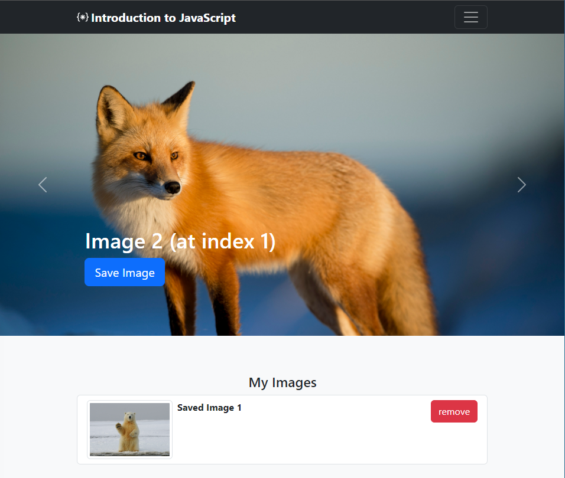

# CPSC1520 -- JavaScript 5 Exercise: Arrays and Loops

> *Do **not** edit this file! If there are any changes/corrections that your instructor offers for this assignment, they will inform you and may make direct changes to this file.*

## Introduction

Arrays are essential data structures that are used not only in JavaScript but essentially every programming language. In this exercise, you'll be creating an array of images, rendering them to the page, and giving the ability to save images to a list.

## Exercise Step 1: Create the Carousel with the images.

1.   Modify the `images` array to include the [image names](./ImageCredits.md) 
    in the images folder.

2.  Create a function named `renderCarousel` that will call the function
    `createCarouselItem` with the correct arguments to render each image in a carousel item
    on the page. You will need to loop through the `images` array to achieve the desired results. You may use any type of loop to accomplish this.

3.  Call the `renderCarousel` function you just created, and the page should change from
    blank to images.

    a.  Before calling the `renderCarousel` method:\
        

    b.  After calling the `renderCarousel` method:\
        

## Exercise Step 2: Add to My Images

1.  Review the event listener given in the JavaScript file for step 2. 

2.  Using array methods, check if the `savedImages` array includes the image
    in the `images` array at the corresponding `itemIndex`.

    a.  If it does not, add the image name to the `savedImages` array using array methods.
        You can use some debugging techniques (console.log etc.) here to display whether
        the array has the item or not.

    b.  If it does, don't do anything (we don't want any duplicates
        here).\
    > Note: this means if I click the "cat" image three times I should only see it once in my `savedImages` list.

3.  Create a function named `renderImageList`. The function will loop
    through the `savedImages` array and call the function
    `addToSavedImageList` with the correct arguments.

    a.  Call this function every time you add an item to the `savedImages`
        array.    
     > Note: Make sure to clear out the existing HTML for the saved list otherwise you'll have duplicates    

4.  If you click the "cat" image twice and the "polar bear" image three
    times, the result should look like below.

## Exercise Step 3 -- Remove items from "My Image" list.

1.  Observe the `itemIndexToRemove` in the given event listener on the saved
    list.

2.  Using array methods, remove the item at the index specified from the
    `savedImages` array.
    > You may want to look into the [splice](https://www.geeksforgeeks.org/javascript/javascript-array-splice-method/) method to accomplish this

4.  Call the function `renderImageList` below that.

5.  Once you have clicked "save Image" on the cat and the "polar bear"
    and then clicked "remove" on the cat, your page should look
    like below.\
    

----

## Grading

This Lab is graded out of **5** marks:

| Grade  |  Criteria |
|---|---|
|  5 |  All requirements satisfied, Code Quality follows class standards  |
|  4 | All requirements satisfied, Code Quality could be improved  |
|  3 |  Most requirements satisfied |
|  2 |  Some requirements satisfied  |
|  1 |  Made a reasonable attempt but no requirements satisfied  |
|  0 | Did not attend the in class lab |

**You can use the automated tests as a guide to help you verify that your solution meets all the requirements. To run the tests simply push your solution to Github and look for the results in the feedback pull request.**
